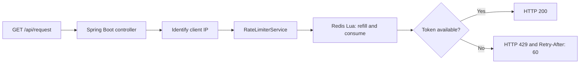

# Redis token-bucket rate limiter

**A personal Java/Spring Boot learning project by Sahilkumar Prasad.**

An API client receives HTTP 200 while tokens remain in its Redis bucket. Once the bucket is exhausted, the endpoint returns HTTP 429 with a retry hint. The refill and token consumption run in one Redis Lua script so concurrent requests do not perform separate, racing reads and writes.

## Problem and scope

The implementation explores a specific backend problem: enforcing a per-client request budget using shared state. It is a small application, not a record of production microservices experience. There is no production traffic, throughput benchmark or measured latency improvement associated with this project.

## Request flow



1. The [controller](../src/main/java/com/ratelimiter/controller/RateLimiterController.java) takes the first `X-Forwarded-For` address when present, otherwise the remote address, and normalizes IPv6 loopback.
2. The [service](../src/main/java/com/ratelimiter/service/RateLimiterService.java) creates a `rate_limit:<clientId>` key and passes capacity, refill amount, refill duration and the current epoch time to Redis.
3. The Lua script reads token count and the last refill timestamp from a Redis hash. A new bucket starts at capacity.
4. It adds tokens for completed refill intervals, caps the balance at capacity, and consumes one token when available.
5. It persists the state and applies a TTL of twice the refill duration. Its result determines the HTTP response.

## Implementation choices and tradeoffs

| Choice | Purpose | Practical limit |
| --- | --- | --- |
| A Redis Lua script | Keep the bucket read, refill and consume operation atomic inside Redis | This does not establish end-to-end availability or protect against client identity spoofing |
| A Redis hash per client | Store tokens and the refill timestamp together | The application needs a trustworthy definition of client identity |
| Discrete refill intervals | Make token replenishment explicit and configurable | This refills in steps, rather than continuously |
| Redis key expiry | Allow inactive bucket state to expire | Twice the refill duration is unsuitable for every capacity/refill configuration |
| HTTP 429 and a retry hint | Tell callers when the bucket has no tokens | The current retry hint is fixed at 60 seconds |

## Verified behavior

The [GitHub Actions run on 26 September 2026](https://github.com/Sahill1001/rate-limiter/actions/runs/36259854983) used Java 17 and Redis 7.4, with `RUN_REDIS_TESTS=true`:

**9 tests passed, 0 failures, 0 errors, 0 skipped.**

| Test group | Count | What it checks |
| --- | --- | --- |
| [Controller tests](../src/test/java/com/ratelimiter/RateLimiterApplicationTests.java) | 4 | Allowed and rejected responses, the retry header, forwarded client identity and IPv6 loopback normalization |
| [Real Redis script tests](../src/test/java/com/ratelimiter/TokenBucketRedisTests.java) | 5 | Capacity exhaustion, refill boundary, capacity cap, independent clients and concurrent token consumption |

The concurrency test submits **40 calls using 8 worker threads** against one bucket with **10 tokens**, using the same supplied timestamp. It asserts that exactly **10 calls are accepted**. This checks the token-budget invariant for that scenario; it is not a throughput benchmark or a test of a production cluster.

The controller tests mock the service. The Redis tests execute the application's actual Lua script using test-controlled timestamps. Together they check selected behavior, not the complete HTTP-to-Redis path or every failure mode.

## Reproduce locally

Use a dedicated Redis instance at `localhost:6379`, then run from the repository root:

```powershell
$env:RUN_REDIS_TESTS = 'true'
mvn test
```

Without that environment variable, the five Redis tests are skipped. The integration tests clean up only their randomly named test keys. See the [workflow](../.github/workflows/tests.yml) for the CI setup.

## Limitations and next steps

- Establish trusted-proxy handling before trusting `X-Forwarded-For` from internet clients.
- Calculate the retry delay from bucket state instead of always returning 60 seconds.
- Define and test what happens when Redis is unavailable; exceptions currently propagate.
- Address time consistency across application instances; the script currently receives the application clock.
- Test additional refill/TTL combinations and add full HTTP integration coverage.
- Measure a reproducible workload before making any performance claim.

The main learning is how atomic state updates relate to application behavior, and how a concurrency assertion differs from evidence of production scale.
